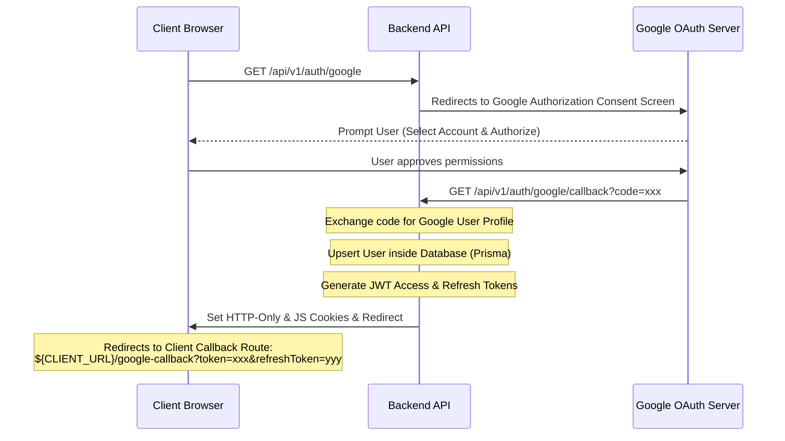

# 🚀 TalkNative - English Practice Platform (API)

A **scalable, robust, and real-time backend API** built with **Node.js, Express, TypeScript, and Prisma**. This API powers the TalkNative platform, an innovative application designed to help users practice English through interactive courses, live video calls, and a supportive community.

## 🔗 Live URL
- **Production Server:** [https://talknative-english-practice-platform-api.onrender.com](https://talknative-english-practice-platform-api.onrender.com)
- **API Documentation (Postman):** See the included `TalkNative_API_Collection.json` for detailed endpoints.

---

## 🛠 Tech Stack

- **Runtime:** Node.js
- **Framework:** Express.js
- **Language:** TypeScript
- **Database ORM:** Prisma
- **Database:** MongoDB
- **Authentication:** JWT (JSON Web Tokens), Google OAuth 2.0 (via Passport.js), OTP via Email (Brevo / Resend)
- **Real-time Communication:** Socket.io (Support Chat, WebRTC Signaling, Live Matchmaking, Real-time Notifications)
- **Payments:** Stripe Integration
- **File Uploads:** Cloudinary (Multer for parsing)
- **Validation:** Zod
- **Caching & Queues:** Redis (required for Matchmaking queue)

---

## 🎯 Key Features

### 🔐 Authentication & Authorization
- **Standard Registration & Login:** Email-based signup and secure sign-in.
- **Google OAuth 2.0 Integration:** Quick registration and login using Google credentials. Registers a new account automatically or logs into existing accounts.
- **Email Verification & OTP:** Secure signups and email confirmation using OTP.
- **Password Recovery:** Forget and Reset password workflows using secure JWT reset links.
- **Role-Based Access Control (RBAC):** Restrict access depending on roles (`ADMIN`, `USER`).

### 🔔 Real-Time Notifications System
- **Database Persisted Notifications:** Logs like `LIKE`, `COMMENT`, `ENROLLMENT`, `ANNOUNCEMENT`, `CALL`, and `SYSTEM` events.
- **Real-Time Push Alerts:** Automatically pushes notification events directly to connected socket clients.
- **REST Endpoints:** Mark individual or all notifications as read, query unread count, and delete notifications.

### 💬 Real-Time Support Chat
- **Live Ticket System:** Dynamic creation of support tickets (Open, Active, Resolved) between Users and Admins.
- **Interactive Chat:** Real-time messages, typing indicators, and immediate notification updates.

### 📹 Live calling & Matchmaking System
- **Active Matchmaking Queue:** Users join a Redis-backed queue and are paired dynamically with an online practice partner.
- **WebRTC Signaling Room:** Automates matching room generation and channels signaling exchanges between users.
- **Post-Call Ratings:** Rate and report partner behavior after practice calls.

### 📚 Course & Lesson Management (LMS)
- **Admins:** Manage and publish courses, lessons, videos, and PDF resources.
- **Users:** Browse courses, enroll, track lesson completion progress, and complete quizzes.

### 💳 Payments & Enrollments
- **Stripe Integration:** Seamless checkout session creation and secure enrollment processing.
- **Stripe Webhooks:** Asynchronously listen to checkout events to instantly activate course enrollment.

---

## ⚙️ Environment Variables

Create a `.env` file in the root directory based on the `.env.example` file. To enable Google Auth and the Socket notification/calling features, make sure the following variables are configured correctly:

```env
# App Configurations
NODE_ENV=development
PORT=8321
CLIENT_URL="http://localhost:3000"

# Database Configuration
DATABASE_URL="mongodb+srv://<username>:<password>@cluster0.mongodb.net/talknative_db?retryWrites=true&w=majority"

# JWT Configurations
JWT_ACCESS_SECRET=your_jwt_access_secret
JWT_REFRESH_SECRET=your_jwt_refresh_secret
JWT_ACCESS_EXPIRES_IN=1h
JWT_REFRESH_EXPIRES_IN=30d
JWT_RESET_PASS_SECRET=your_reset_pass_secret
JWT_RESET_PASS_EXPIRES_IN=10m

# Email Configurations
EMAIL_HOST=smtp.gmail.com
EMAIL_PORT=587
EMAIL_USER=your_email@gmail.com
EMAIL_PASS=your_app_password
EMAIL_FROM="TalkNative <noreply@talknative.com>"
BREVO_API_KEY=your_brevo_api_key

# Google OAuth 2.0 Credentials (New Update 🚀)
GOOGLE_CLIENT_ID=your_google_client_id.apps.googleusercontent.com
GOOGLE_CLIENT_SECRET=your_google_client_secret
GOOGLE_CALLBACK_URL="http://localhost:8321/api/v1/auth/google/callback"

# Stripe Configurations
STRIPE_SECRET_KEY=sk_test_...
STRIPE_WEBHOOK_SECRET=whsec_...

# Cloudinary Storage
CLOUDINARY_CLOUD_NAME=your_cloud_name
CLOUDINARY_API_KEY=your_api_key
CLOUDINARY_API_SECRET=your_api_secret

# Redis (Required for Matchmaking Queue)
REDIS_HOST=127.0.0.1
REDIS_PORT=6379
```

---

## 📖 API Endpoints Reference

### 1. Authentication
| Method | Endpoint | Description |
| :--- | :--- | :--- |
| **POST** | `/api/v1/auth/login` | Login with email and password |
| **POST** | `/api/v1/auth/logout` | Logout user (clears HTTP-Only cookies) |
| **POST** | `/api/v1/auth/forgot-password` | Send password reset link to email |
| **POST** | `/api/v1/auth/reset-password` | Reset password using a valid token |
| **POST** | `/api/v1/auth/verify-email` | Verify registration email using OTP |
| **POST** | `/api/v1/auth/resend-otp` | Resend OTP code |
| **GET** | `/api/v1/auth/google` | Initiates Google OAuth Login Flow |
| **GET** | `/api/v1/auth/google/callback` | Google OAuth redirect callback endpoint |

### 2. Notifications (New Update 🚀)
| Method | Endpoint | Auth | Description |
| :--- | :--- | :--- | :--- |
| **GET** | `/api/v1/notification` | `User`/`Admin` | Fetch all user notifications (paginated) |
| **GET** | `/api/v1/notification/unread-count` | `User`/`Admin` | Retrieve count of unread notifications |
| **PATCH** | `/api/v1/notification/:id/read` | `User`/`Admin` | Mark a specific notification as read |
| **PATCH** | `/api/v1/notification/mark-all-read` | `User`/`Admin` | Mark all notifications as read |
| **DELETE** | `/api/v1/notification/:id` | `User`/`Admin` | Delete a single notification |
| **DELETE** | `/api/v1/notification` | `User`/`Admin` | Delete all user notifications |

---

## 📡 Socket.io Events Reference

The backend uses namespaces and specific payload structures to orchestrate real-time updates.

### 1. General Events
- **`online_count_update`** *(Server $\rightarrow$ Client)*
  - Triggers on client connection/disconnection.
  - **Payload:** `{ count: number }`

### 2. Real-Time Notification Rooms
To receive real-time notifications, client applications must join their personal notification room after authenticating.

- **`join_notification_room`** *(Client $\rightarrow$ Server)*
  - Registers the client to their user-specific room.
  - **Payload:** `userId` (string)
- **`notification`** *(Server $\rightarrow$ Client)*
  - Pushed to the room `user:${userId}` whenever a notification is triggered.
  - **Payload:**
    ```json
    {
      "id": "notification_id",
      "userId": "user_id",
      "senderId": "sender_id_or_null",
      "type": "CALL | ENROLLMENT | ANNOUNCEMENT | SYSTEM | COMMENT | LIKE",
      "title": "Notification Title",
      "message": "Notification details",
      "link": "/relevant-route-url",
      "isRead": false,
      "createdAt": "ISOString"
    }
    ```

### 3. Matchmaking & Audio/Video Call Signaling
- **`join_matchmaking`** *(Client $\rightarrow$ Server)*
  - Adds the user to the active matchmaking Redis queue.
  - **Payload:** `{ userId: string, name: string }`
- **`match_found`** *(Server $\rightarrow$ Client)*
  - Broadcasts to both matched users when pairing completes.
  - **Payload:**
    ```json
    {
      "roomId": "call_callerId_calleeId_timestamp",
      "partnerId": "partner_user_id",
      "partnerName": "Partner Display Name",
      "partnerAvatar": "avatar_url",
      "partnerLanguage": "Bengali",
      "members": ["user_id_1", "user_id_2"]
    }
    ```
- **`join_call_room`** *(Client $\rightarrow$ Server)*
  - Client enters the assigned signaling room.
  - **Payload:** `{ roomId: string }`
- **`signal`** *(Client $\leftrightarrow$ Server)*
  - Forwards WebRTC peer connection descriptors (SDP offer/answer, ICE Candidates).
  - **Client Emits Payload:** `{ roomId: string, signal: any, to: string }`
  - **Server Receives/Emits:** `{ from: socket_id, signal: any }`
- **`leave_call`** *(Client $\rightarrow$ Server)*
  - Cleanly exits the call session.
  - **Payload:** `{ roomId: string, userId: string }`
- **`partner_left`** *(Server $\rightarrow$ Client)*
  - Fired to the remaining user in a room when their partner disconnects or leaves.

### 4. Support Support & Support Chat
- **`joinTicket`** *(Client $\rightarrow$ Server)*
  - Joins room `ticket_${ticketId}`.
  - **Payload:** `ticketId` (string)
- **`leaveTicket`** *(Client $\rightarrow$ Server)*
  - Exits room `ticket_${ticketId}`.
  - **Payload:** `ticketId` (string)
- **`sendMessage`** *(Client $\rightarrow$ Server)*
  - Persists and broadcasts messages.
  - **Payload:** `{ ticketId: string, senderId: string, senderModel: "User" | "Admin", content: string }`
- **`newMessage`** *(Server $\rightarrow$ Client)*
  - Broadcasts to all users in the specific ticket room.
- **`ticketUpdated`** *(Server $\rightarrow$ Admins)*
  - Dispatched to administrative room `"admin_support"` to keep the support agent queues updated.
- **`typingStart` / `typingStop`** *(Client $\leftrightarrow$ Server)*
  - Broadcasts typing indicators to the counterpart in the ticket room.
  - **Payload:** `{ ticketId: string, senderId: string }`
- **`userStatusChange`** *(Client $\leftrightarrow$ Server)*
  - Updates other active sockets of status changes.
  - **Payload:** `{ userId: string, status: "online" | "offline" }`

---

## 🗝️ Google Auth Integration Flow



---

## 🗄️ Database Setup (Prisma)

Run the following commands to generate the Prisma client and push the schema to your MongoDB database:

```bash
# Generate the Prisma Client
npx prisma generate

# Push the schema to MongoDB database
npx prisma db push
```

To seed the database with a default Admin account:
```bash
npm run seed
```

---

## 🏃 Running the Application

Ensure your local Redis server is active before starting:
```bash
# Run in development mode (with hot-reload)
npm run dev

# Build for production
npm run build

# Start production build
npm start
```

---

## 📁 Folder Structure

```
src/
├── app/
│   ├── config/            # Environment configs & passport initialization
│   ├── errors/            # Custom AppError & Global handler
│   ├── middlewares/       # Auth validation, parsing & error handling middlewares
│   ├── modules/           # Modular Domain logic
│   │   ├── auth/          # Google and Standard Password login auth
│   │   ├── user/          # Profile details
│   │   ├── course/        # LMS courses
│   │   ├── lesson/        # LMS lessons
│   │   ├── chat/          # Support ticket message controller and sockets
│   │   ├── call/          # WebRTC Call controllers, service and matchmaking sockets
│   │   ├── notification/  # Notification REST controller & routes (New 🚀)
│   │   └── ...
│   ├── routes/            # Merged API routes index
│   └── utils/             # Redis, Socket initialization, Email sender helpers
├── prisma/                # Modular schemas (compiled via prisma client)
└── server.ts              # Express initialization and server bootloader
```

---

## 🛡️ Security & Best Practices

- **Strict Validation:** Request payloads are checked using **Zod** schema schemas before hitting controllers.
- **Centralized Errors:** Custom `ApiError` class combined with `catchAsync` wrappers ensures that server crashes are prevented and responses are neatly structured.
- **Environment Separation:** Dev and Production environments are supported, including secure SameSite settings on auth cookies.

---

## 📝 License
This project is proprietary and intended for TalkNative operations.
